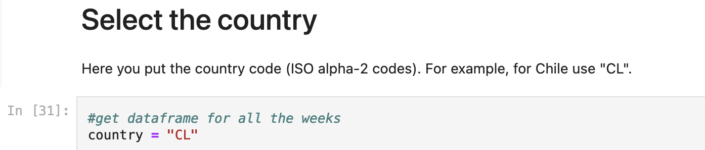
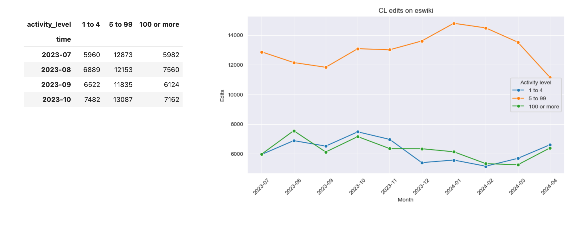

# Wikimedia Edits and Editors by Country

## Overview

This project provides a Jupyter Notebook that visualizes the edits and editors of Wikimedia projects for a country of a choice. The data is sourced directly from the Wikimedia Foundation and has been processed to maintain privacy through [differential privacy](https://en.wikipedia.org/wiki/Differential_privacy) techniques. You can find more information about the dataset [here](https://analytics.wikimedia.org/published/datasets/geoeditors_monthly/00_README.html).

The initial set-up was done by HTriedman (WMF), and you can find the example [here](https://public-paws.wmcloud.org/User:HTriedman%20(WMF)/private_geoeditors_data_access.ipynb).

The data is grouped into three user levels based on the number of edits made within a given period (either monthly or weekly):

* **1-4 edits** : Users who make between 1 and 4 edits.
* **5-99 edits** : Users who make between 5 and 99 edits.
* **100 or more edits** : Users who make 100 or more edits.

## Features

* **Visualization** : Instantaneous plots showcasing edits and editors for English Wikipedia, Spanish Wikipedia, Wikimedia Commons, and Wikidata.
* **Country-specific Data** : Easily adjustable to view data for different countries.
* **Data Frequency** : Choice between monthly or weekly data representation.

## Getting Started

### Prerequisites

* Python 3.x
* Jupyter Notebook
* Pandas
* Matplotlib
* Requests
* Seaborn

### Installation

You can either download the monthly or weekly code and run it locally on your computer with a code editor. Or you can use an online Notebook, for example [PAWS](https://wikitech.wikimedia.org/wiki/PAWS). 

## Usage

1. Open the `geoeditors_monthly.ipynb`  or the `geoeditors_weekly.ipynb` in a Jupyter Notebook.
2. Adjust the country variable to your desired country.
3. Run the notebook to generate visualizations.

For example, for Spanish Wikipedia, you'll see the following sections:

* **Editors Section** : This section contains data about the number of editors, segmented by user levels.
* **Edits Section** : This section provides detailed data and visualizations of the edits.

First, you'll see a table with the raw data, followed by plots that visualize the edit patterns over time.

### Steps in Detail

1.**Open the Notebook** :

* Launch Jupyter Notebook and open geoeditors_monthly.ipynb `or the`geoeditors_weekly.ipynb .

**2. Adjust Country Variable** :

* Locate the cell where the country variable is defined.
* Change the country name to the one you are interested in (e.g., `country = "Chile"`).
* You have to choose from the [ISO alpha-2 codes](https://en.wikipedia.org/wiki/ISO_3166-1_alpha-2).

**3. Run the Notebook** :

* Execute the cells in the notebook sequentially.
* The notebook will process the data and generate visualizations accordingly.

## Contributing

Pull requests are welcome. For major changes, please open an issue first to discuss what you would like to change.

## License

This project is licensed under the GNU General Public License v3.0. See `LICENSE` for more details.

## Acknowledgments

* Data sourced from the Wikimedia Foundation.
* Inspiration and initial structure from the provided example by HTriedman (WMF).
